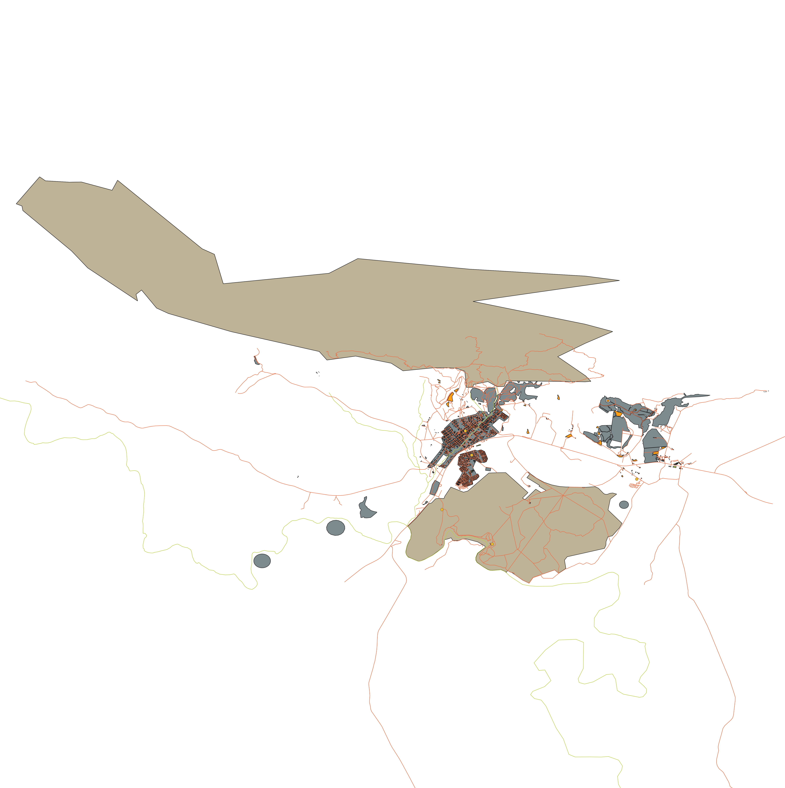

# Creating and Exploring a Basic Map

## Adding your first layers

`Data Source Manager` 

- Allows you to choose data to load
- `Shapefiles`: 
- `GeoPackage`: (Open format) Container that allows storing multiple GIS datums
  (vector & raster) in a single file
  - Connection must be made to a GeoPackage as it is a database
  - After connection is made you can load contained content
- `SpaciaLite`: (Extension of SQLite) Create connection -> Connect -> Add layer(s)

Layer order matters: Drawn from bottom to top.

- Behavior can be modified using `Control rendering order` checkbox

## Map Navigation

Panning tool pans :o

When zoom tool is selected you can click and drag a rectangle selector over the
map and zoom to the selection on release

> Though I'll just mmb and scrollwheel my way around, I think this behavior
> might be especially useful for exporting images

Viewchanges are saved in a history, allowing backtracking to previous views.

- `Zoom last` and `Zoom next` to iterate over history

`Zoom Full Extent` will fit the largest layer to the viewport

`Scale` value

- Valaue to the right of `:` represents how many times smaller the object you
  are seeing in the Map Canvas is to the object in the real world.

## Symbology
