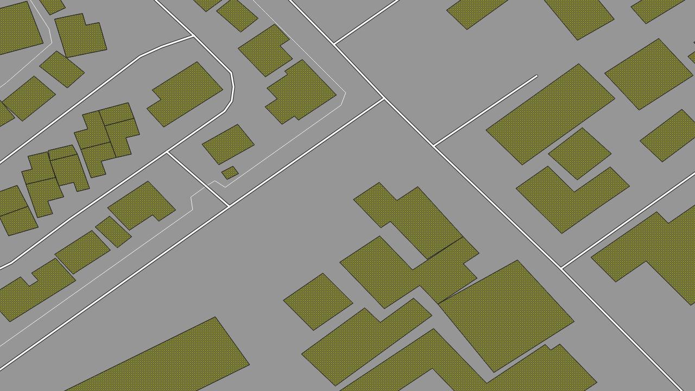
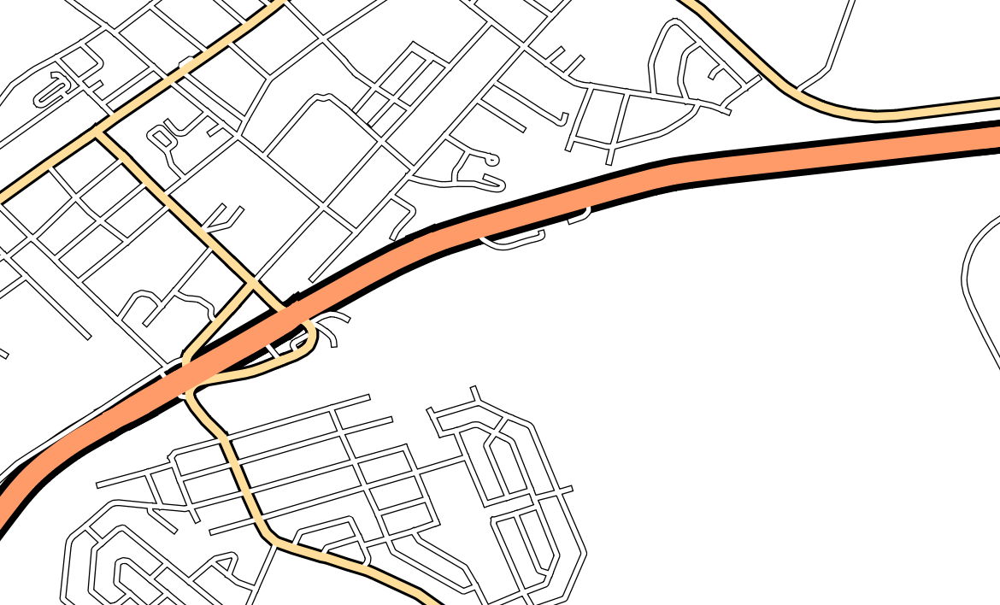
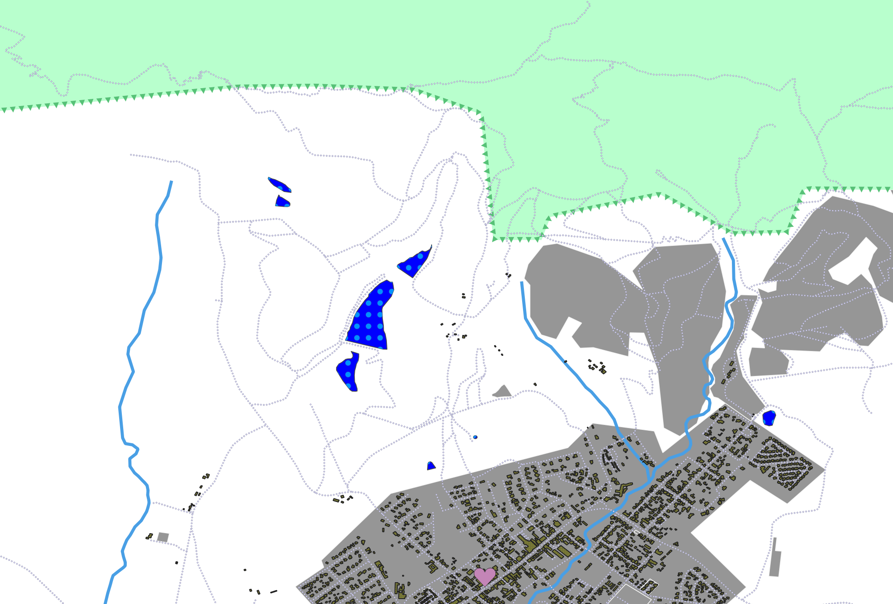

# Creating and Exploring a Basic Map

## Adding your first layers

`Data Source Manager` 

- Allows you to choose data to load
- `Shapefiles`: 
- `GeoPackage`: (Open format) Container that allows storing multiple GIS datums
  (vector & raster) in a single file
  - Connection must be made to a GeoPackage as it is a database
  - After connection is made you can load contained content
- `SpaciaLite`: (Extension of SQLite) Create connection -> Connect -> Add layer(s)

Layer order matters: Drawn from bottom to top.

- Behavior can be modified using `Control rendering order` checkbox

## Map Navigation

Panning tool pans :o

When zoom tool is selected you can click and drag a rectangle selector over the
map and zoom to the selection on release

> Though I'll just mmb and scrollwheel my way around, I think this behavior
> might be especially useful for exporting images

Viewchanges are saved in a history, allowing backtracking to previous views.

- `Zoom last` and `Zoom next` to iterate over history

`Zoom Full Extent` will fit the largest layer to the viewport

`Scale` value

- Valaue to the right of `:` represents how many times smaller the object you
  are seeing in the Map Canvas is to the object in the real world.

## Symbology

Symbology of a layer is it's visual appearance on the map.

Visual appearance is very important: 

- GIS's basic strength is allowing for dynamic visual representations of the
  data you're working with
- End users **need** to easily see what the map represents
- **You** need to be able to exlore the data you're working with

### Tinkering

**Changing colors**

- Changed under `Layer Properties/Symbology`
- Outline patterns
- Making patterns is neat- spent a little time reworking the "Zelda" pattern to
  be a transparent checkerboard of red squares

**Scale based visibiliity**

- Configured under `Layer Properties/Rendering`, enable `Scale Dependent Visibility`
- Some layers not suitable at different scalees (i.e. buildings at 1:1000000)

**Symbol Layers**

Kinda already did this while tinkering with "Zelda"

- Draw order works the same way as `Layers`, bottom to top.

**Symbol Levels**

Giving a black outline to roads with a solid white fill causes ugly overlaps
intersections this is fixed by enabling and configuring `Layer
Properties/Advanced/Symbol Levels` to explicitly declare what order each layer
symbol is rendered.

- Merely enabling it for 2 Symbol Layers is sufficient in this case.

> Symbol Syles can be saved and loaded to/from disk in `QGIS QML Style File`
> format

**Symbol Levels on Classified Layers**

Symbol Levels also work for Classified layers 

- Classified layers consist of multiple symbols

#### Symbol Layer Types

Each vector (point, line, and polygon) has its own set of symbol layer types

